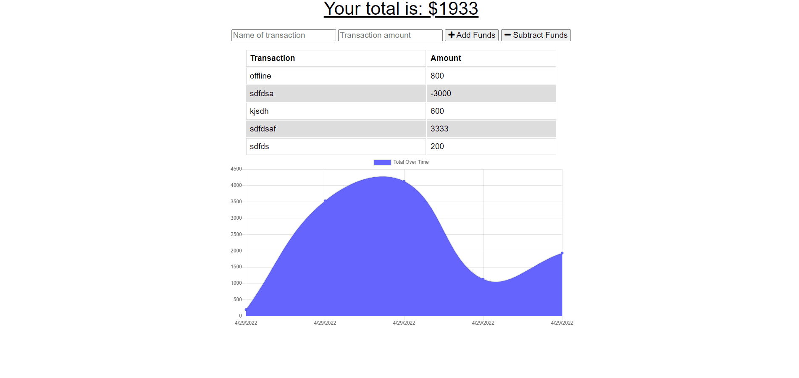

## Budget Tracker

## Table of Contents

- [Description](#Description)
- [Deployment](#Deployment)

## Description

Budget Tracker app includes a service worker, web manifest and uses IndexedDB for offline functionality. These technologies and a slick ui allow users to track their budget no matter the internet speeds.

## Deployment

- https://budget-tracker-dda.herokuapp.com/

## Contact Me

- dominiqued.akers@gmail.com
- https://www.linkedin.com/in/dominique-akers-319a07154/